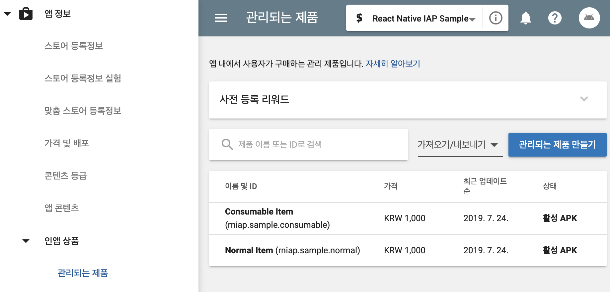
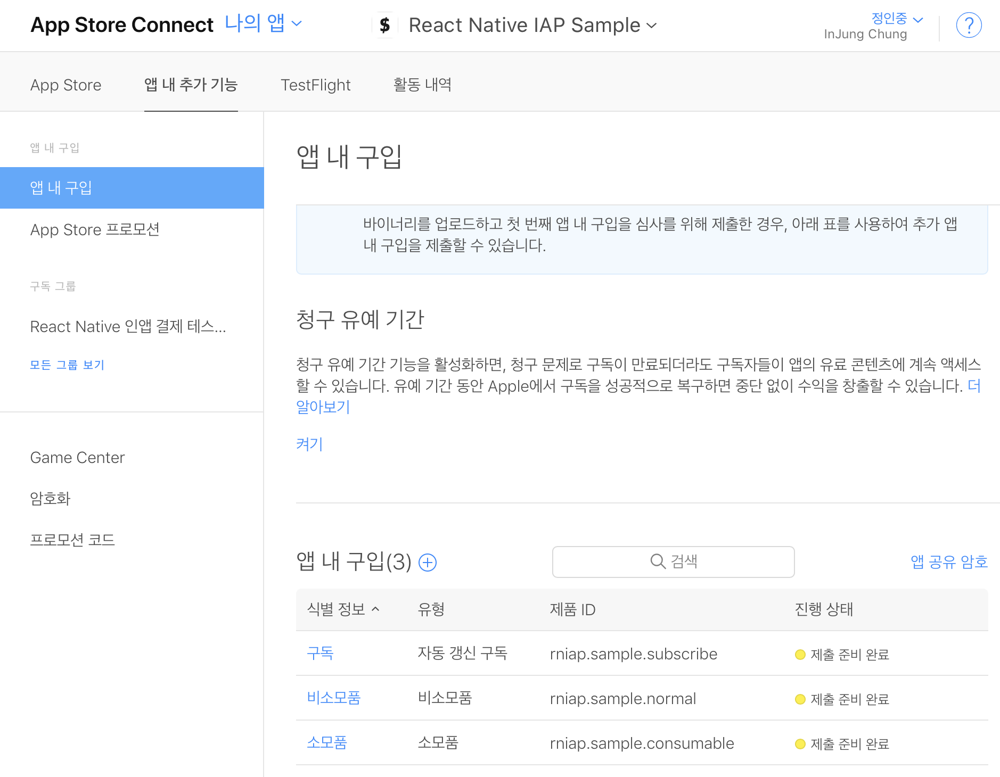

# react-native-in-app-purchase

[](https://www.npmjs.com/package/@mu29/react-native-in-app-purchase)
[](https://www.npmjs.com/package/@mu29/react-native-in-app-purchase)
[](https://www.npmjs.com/package/@mu29/react-native-in-app-purchase)

👻 A dead simple In-App Purchase library for React Native

## Getting started

```bash
$ yarn add @mu29/react-native-in-app-purchase

# RN >= 0.60
cd ios && pod install

# RN < 0.60
react-native link @mu29/react-native-in-app-purchase
```

### Android

Add `BILLING` permission to the `AndroidManifest.xml`.

```xml
<manifest
  xmlns:android="http://schemas.android.com/apk/res/android"
  package="com.rninapppurchasesample">

    <uses-permission android:name="android.permission.INTERNET" />
    <uses-permission android:name="com.android.vending.BILLING" />

    ...
</manifest>
```

Create your app in the Google Play Console, and add product in the In-App Products section. Make sure set the product status to **active** so that you can view or purchase it.

[](docs/android_1.png?raw=true)

Note that testing Android In-App Billing is only possible after uploading your APK to Alpha release or above.

### iOS

Add In-App Purchase capability in the Signing & Capabilities section of the project.

[](docs/ios_1.png?raw=true)

Create your app in the App Store Connect, and add product in the In-App Purchases section. You may need to fill the audit information field.

[](docs/ios_2.png?raw=true)

Testing iOS In-App Purchase is possible on TestFlight.

## Usage

See full example [here](sample/App.js). This sample can also be downloaded from the [Play Store](https://play.google.com/store/apps/details?id=com.rninapppurchasesample).

#### 1. Prepare product ids

Choose the product id that you want to sell. It would be nice to have the same product id for Android and iOS.

```javascript
import InAppPurchase from '@mu29/react-native-in-app-purchase';

const PRODUCT_IDS = [
  'rniap.sample.normal',
  'rniap.sample.consumable',
  'rniap.sample.subscribe',
];
```

#### 2. Add Listeners

For some reasons, the `purchase` and `fetchProducts` functions are not `Promise`. So you need to register the `onPurchase` and `onFetchProducts` listeners.

```javascript
const onFetchProducts = (products) => {
  this.setState({ products });
}

const onPurchase = (purchase) => {
  // Validate payment on your backend server with purchase object.
  setTimeout(() => {
    // Complete the purchase flow by calling finalize function.
    InAppPurchase.finalize(purchase, purchase.productId === 'rniap.sample.consumable').then(() => {
      Alert.alert('In App Purchase', 'Purchase Succeed!');
    });
  });
}

const onError = (e) => {
  console.log(e);
}

InAppPurchase.onFetchProducts(onFetchProducts);
InAppPurchase.onPurchase(onPurchase);
InAppPurchase.onError(onError);
```

After each purchase, you need to verify the receipt on your server. If the purchase is valid, call `finalize` function in the app. Set whether it is consumable or not as the second argument to the `finalize` function.

#### 3. Configure and Fetch Products

Once you have registered your listeners, call `configure` and `fetchProducts`. Since the library will initialize billingClient only once, you can call `configure`, `fetchProducts` multiple times.

```javascript
InAppPurchase.configure().then(() => {
  InAppPurchase.fetchProducts(PRODUCT_IDS);
});
```

#### 4. Purchase Product

Call `InAppPurchase.purchase` with product id.

```javascript
InAppPurchase.purchase(item.productId) // 'rniap.sample.consumable'
```

#### 5. Retry

In some cases, your app may not be able to call the `finalize` function even the purchase was successful. (such as poor internet connection) Purchases that are not finalized can be retrieved with the `flush` function. Send these purchases to the server to verify, and then call the `finalize` function.

```javascript
InAppPurchase.flush().then((purchases) => {
  purchases.forEach(onPurchase);
});
```

## Type Definitions

Type definitions of Product, Purchase and IAPError.

#### Product

Property    | Type   | Comment
--------    | ----   | -----------
productId   | string | -
price       | string | -
currency    | string | Currency code (USD, KRW...)
title       | string | -
description | string | -

#### Purchase

Property        | Type   | Comment
--------        | ----   | -----------
productId       | string | -
transactionId   | string | -
transactionDate | string | -
receipt         | string | Use this property to validate iOS purchase
purchaseToken   | string | Use this property to validate Android purchase

#### IAPError

Property | Type                                 | Comment
-------- | ----                                 | -----------
type     | FETCH_PRODUCTS, PURCHASE, CONNECTION | `CONNECTION` error is only occurs on Android.
code     | number                               | -
message  | string                               | -

## Receipt Verification

Actually this isn't something that should be mentioned in this document. However, since it's critical part of implementing In-App Purchase flow, I'll show you how I implemented it.

#### Client Side

```typescript
const onPurchase = useCallback((result: Purchase) => {
  return verifyReceipt({
    variables: {
      input: {
        platform: Platform.select({
          ios: 'apple',
          android: 'google',
        }),
        productId: result.productId,
        receipt: Platform.select({
          ios: result.receipt,
          android: result.purchaseToken,
        }),
      },
    },
  })
  .then(() => InAppPurchase.finalize(result, true))
  .then(() => Alert.alert(LocalizedStrings.COIN_PURCHASE_SUCCESS_TITLE, LocalizedStrings.COIN_PURCHASE_SUCCESS_MESSAGE))
  .catch(e => Alert.alert(LocalizedStrings.COMMON_ERROR, e.message))
  .finally(() => setIsLoading(false));
}, [setIsLoading, verifyReceipt]);
```

#### Server Side

Here I used [node-iap](https://github.com/Wizcorp/node-iap) library.

```typescript
class VerifyReceipt extends Interactor<Params, Result> {
  public async perform() {
    const {
      user,
      platform,
      productId,
      receipt,
      language,
    } = this.context;

    if (!['apple', 'google'].includes(platform)) {
      throw new functions.https.HttpsError(
        'invalid-argument',
        LocalizedStrings(language).ERROR_RECEIPT_VALIDATE_FAILURE,
      );
    }

    return new Promise<Result>((resolve, reject) => {
      iap.verifyPayment(platform, {
        receipt,
        productId,
        packageName: PACKAGE_NAME,
        keyObject: require('../../../iapServiceAccountKey.json'),
      }, async (error, response) => {
        if (error) {
          return reject(new functions.https.HttpsError('aborted', error.message));
        }

        // If it's already consumed
        if (platform === 'google' && response.receipt.purchase_state === 1) {
          return reject(new functions.https.HttpsError(
            'unavailable',
            LocalizedStrings(language).ERROR_RECEIPT_NOT_FOUND,
          ));
        }

        const coin = COIN_LIST[language].find(c => c.id === productId);

        // Unavailable product
        if (!coin) {
          return reject(new functions.https.HttpsError(
            'unavailable',
            LocalizedStrings(language).ERROR_RECEIPT_VALIDATE_FAILURE,
          ));
        }

        const orderId = response.transactionId;

        // If it's already verified
        const userRef = firestore().collection('users').doc(user.id);
        const transactionSnapshot = await userRef.collection('transactions').where('orderId', '==', orderId).get();
        if (transactionSnapshot.docs.length > 0) {
          return resolve({
            transaction: transactionSnapshot.docs[0].data() as Transaction,
            profile: user,
          });
        }

        const now = Date.now();
        const batch = firestore().batch();
        const receiptRef = userRef.collection('receipts').doc();
        const transactionRef = userRef.collection('transactions').doc();

        const transaction = {
          id: transactionRef.id,
          description: LocalizedStrings(language).DESCRIPTION_PURCHASE_COIN,
          orderId,
          amount: coin.amount,
          createdAt: now,
        };

        batch.set(receiptRef, {
          id: receiptRef.id,
          productId,
          orderId,
          createdAt: now,
        });

        batch.set(userRef, {
          coin: firestore.FieldValue.increment(coin.amount),
        }, {
          merge: true,
        });

        batch.set(transactionRef, transaction);

        await batch.commit();

        resolve({
          transaction,
          profile: {
            ...user,
            coin: user.coin + coin.amount,
          },
        });
      });
    });
  }
}
```

Note the part *If it's already verified*. Purchases that have already been verified should also return **success**. Otherwise, the item will be provided multiple times when flushing.

## Contributing

Bug reports and pull requests are welcome on [GitHub](https://github.com/mu29/react-native-in-app-purchase/issues).

## License

The package is available as open source under the terms of the [MIT License](LICENSE).
